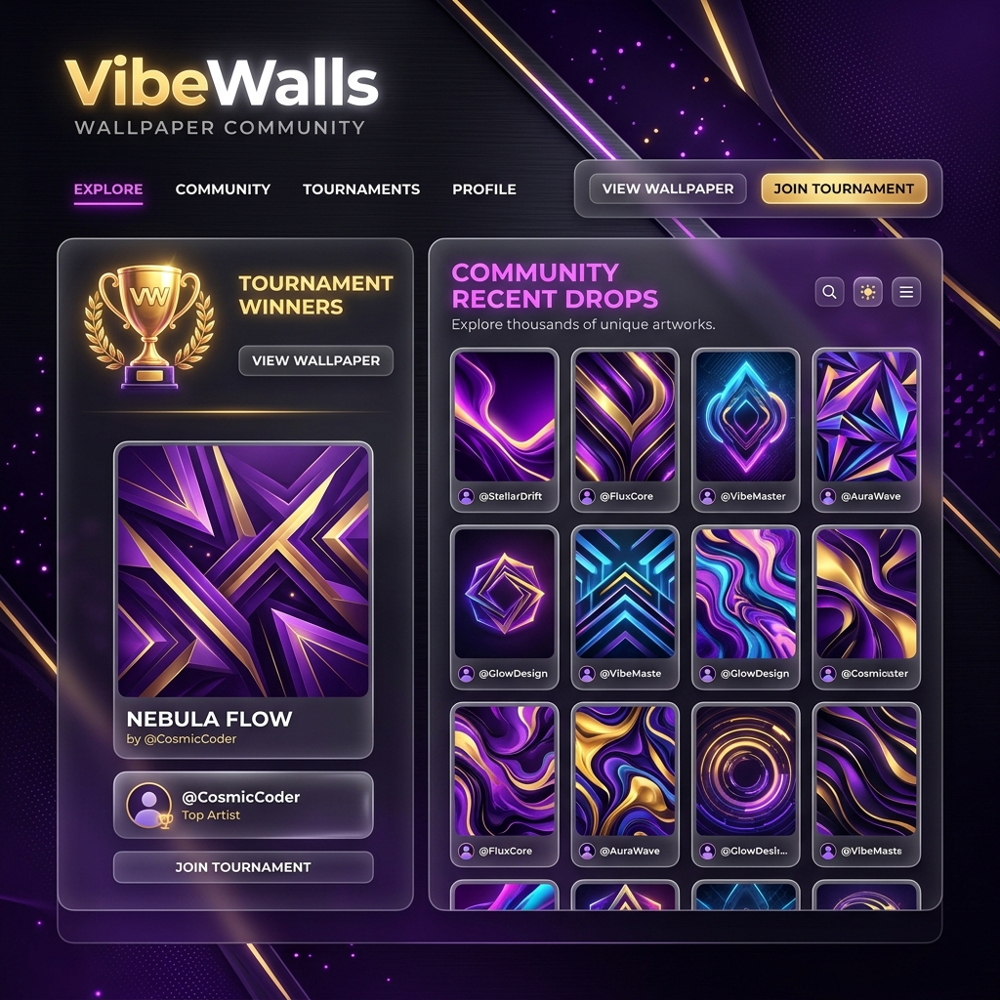
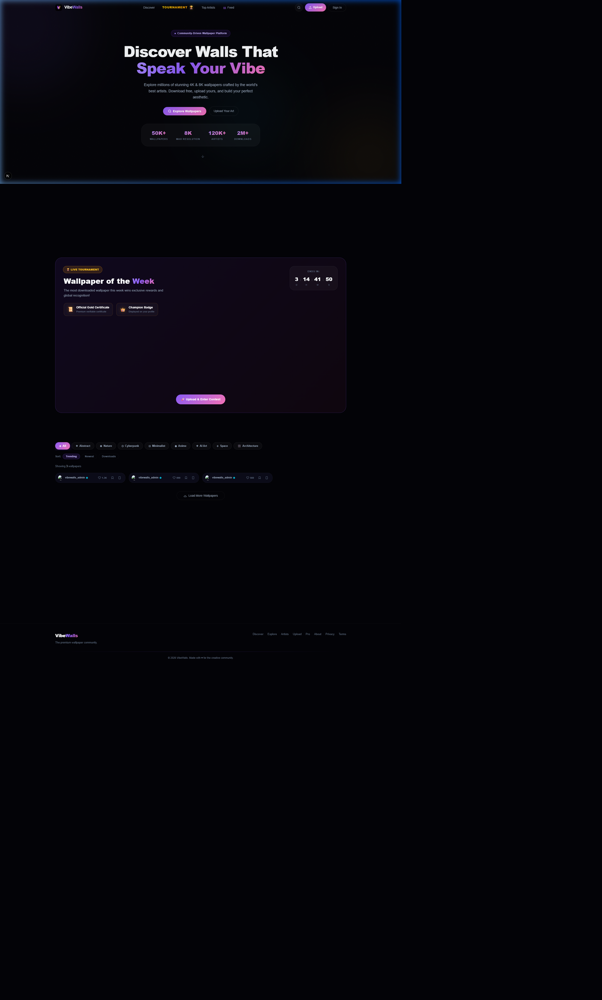
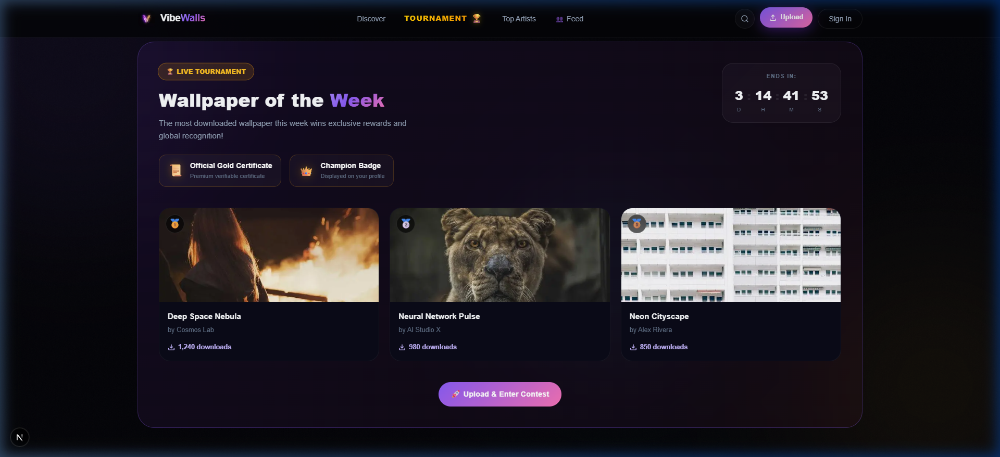
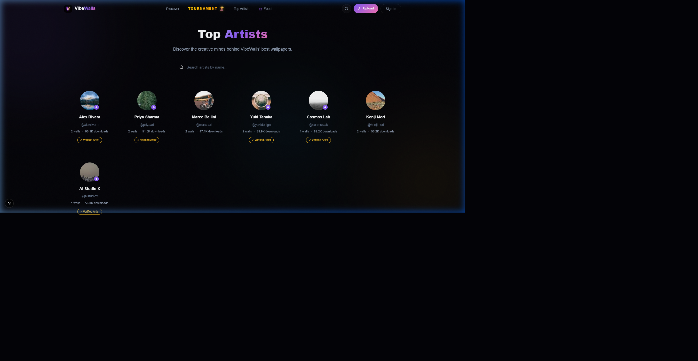

# 🌌 VibeWalls — Premium Wallpaper Community



> **Elevate your digital space.** A high-performance community platform where creators win, art is celebrated, and every vibe matters. Built for the next generation of wallpaper artists.

[](https://nextjs.org/)
[](https://supabase.com/)
[](https://cloudinary.com/)
[](https://www.framer.com/motion/)

---

## 🔥 Key Features

### 💎 Premium Experience
- **Liquid Materialization Preloader**: A world-class intro animation that sets the vibe.
- **Glassmorphic UI**: High-end aesthetics with custom CSS glassmorphism.
- **Masonry Grid Layout**: Optimized wallpaper gallery inspired by Pinterest.

### 🎨 Artist Powerhouse
- **Dynamic Profile Management**: Custom bios, username handles, and total stats tracking.
- **Wallpaper Upload System**: Direct-to-cloud upload with automatic resolution detection.
- **Verified Artist System**: Visual verification badges for trusted creators.

### 📱 Advanced Interactivity
- **Device Preview Engine**: Real-time mockup preview of wallpapers on mobile and desktop frames.
- **Instant Search**: Blazing fast search results across categories and tags.
- **Interactive Daily Vibe**: A fresh "Wallpaper of the Day" featured prominently on the home page.

### 🏆 Gamification & Rewards
- **Live Weekly Tournaments**: Competitive events to find the community's favorite art.
- **XP & Leveling System**: Earn points for uploads, likes, and engagement.
- **Digital Certificates**: Verifiable certificates for tournament winners.

### 🛡️ Secure Infrastructure
- **Supabase Integration**: Row Level Security (RLS) ensuring data integrity.
- **Google OAuth**: Fast and secure authentication for all users.
- **Cloudinary Optimization**: Automatic image compression and CDN delivery.

---

## 🛠 Tech Stack

- **Framework**: Next.js 15 (App Router)
- **Language**: TypeScript
- **Database**: Supabase (PostgreSQL)
- **Media Hosting**: Cloudinary
- **Animations**: Framer Motion
- **Styling**: Vanilla CSS Modules (Premium Glassmorphism)

---

## 🚀 Getting Started

### Installation

1. **Clone the repo:**
   ```bash
   git clone https://github.com/your-username/vibewalls.git
   ```

2. **Install Deps:**
   ```bash
   npm install
   ```

3. **Env Setup:**
   Create `.env.local` and add your Supabase and Cloudinary credentials.

4. **Run Dev:**
   ```bash
   npm run dev
   ```

---

## 📸 Screen Previews
| Home Page | Live Tournament | Artists Feed |
|---|---|---|
|  |  |  |

---

## 🤝 Contributing
Contributions are what make the open source community such an amazing place to learn, inspire, and create. Any contributions you make are **greatly appreciated**.

---

<p align="center">
  Built with ❤️ by <b>Prince</b> & <b>VibeWalls Team</b>
</p>
